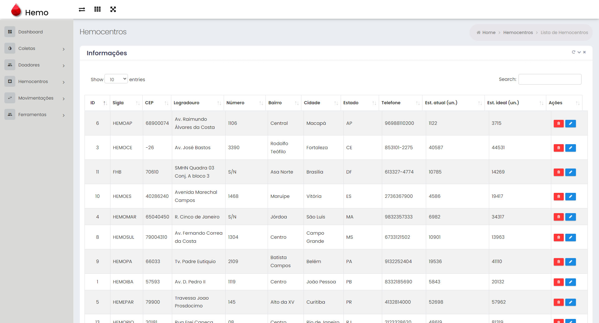
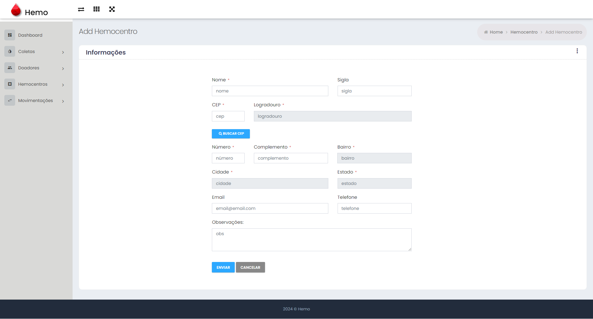
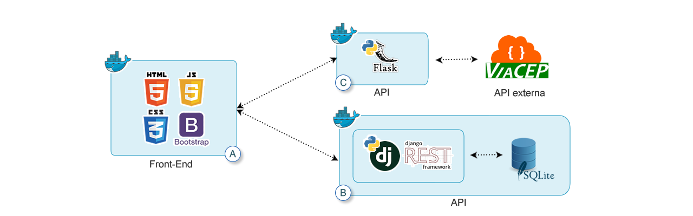

<h1 align="center">
    
</h1>


<p align="center">
 <a href="#-sobre-o-projeto">Sobre</a> •
 <a href="#-funcionalidades">Funcionalidades</a> •
 <a href="#-layout">Layout</a> • 
  <a href="#-arquitetura">Arquitetura</a> • 
 <a href="#-como-executar-o-projeto">Como executar</a> • 
 <a href="#-tecnologias">Tecnologias</a> • 
 <a href="#-autor">Autor</a> • 
 <a href="#user-content--licença">Licença</a>
</p>


<h4 align="center"> 
	Em desenvolvimento
</h4>

## Sobre o projeto

O projeto tem como finalidade centralizar informações sobre hemocentros, coletas e doadores. Permitindo o cadastro de hemocentros, doações, doadores e possíveis doadores. Visualize os dados em um dashboard que mostra unidades doadas no dia, comparação de crescimento de possíveis doadores cadastrados e doadores que já realizaram doações, comparação entre estoque ideal de unidades de sangue e estoque real de unidades, número de doçãoes por dia de cada tipo sanguíneo. Os dados podem ser visualizados por hemocentro, por estado ou todo o país (todos os hemocentros cadastrados). 

Busque doadores cadastrados no sistema próximos aos hemocentros ou próximo a um endereço informado (PCM - ponto de coleta móvel). Selecione o hemocentro (ou PCM), informe a distância (Km) e escolha ação a ser realizada: enviar e-mail, enviar SMS ou enviar mensagem via Whatsapp/Telegram


Projeto desenvolvido para atender ao MVP da disciplina de Desenvolvimento Full Stack Avançado (PUC-RIO).

⚠️ Este projeto é divido em três partes, conforme <a href="#-arquitetura">Arquitetura</a> mostrada abaixo.<br/>

---

## Funcionalidades

- [x] Cadastro de Hemocentros, Doadores e Coletas
- [ ] Cadastro de PCM (Ponto de coleta Móvel)
- [x] Busca por doadores/possíveis doadores por distância: 
  - [x] listar doadores selecionando hemocentro cadastrado
  - [ ] listar doadores selecionando PCM cadastrado
  - [ ] ações de contato com doadores/possíveis doadores (E-Mail, SMS ...)
- [ ] Dados dinâmicos (Gráficos Dadhboard)
- [ ] Autenticação por Token JWT 

---

## Layout


<div align="center">
    
    
</div>

<div align="center">
    
    
</div>

---

##  Arquitetura


<h1 align="center">
    
</h1>

Este projeto é divido em três partes:
1. Frontend (A)
2. API (B) ([Readme](https://github.com/leoaguiar07/hemo_api_mvp_av))
3. API (C) ([Readme](https://github.com/leoaguiar07/hemo_cep_api_mvp_av))


💡 O Frontend precisa que as APIs (B e C) estejam sendo executadas para funcionar perfeitamente.

---

### Pré-requisitos

Certifique-se de ter o [Docker](https://docs.docker.com/engine/install/) instalado e em execução em sua máquina.


---

## Como executar o projeto (Frontend)

### Modo de desenvolvimento

Basta fazer o download do projeto e abrir o arquivo src/index.html no seu browser.

### Através do Docker

Certifique-se de ter o [Docker](https://docs.docker.com/engine/install/) instalado e em execução em sua máquina.

Navegue até o diretório que contém o Dockerfile no terminal e seus arquivos de aplicação e
Execute **como administrador** o seguinte comando para construir a imagem Docker:

```
$ docker build -t nome_da_sua_imagem .
```

Uma vez criada a imagem, para executar o container basta executar, **como administrador**, seguinte o comando:

```
$ docker run -d -p 8080:80 nome_da_sua_imagem
```

Uma vez executando, para acessar o front-end, basta abrir o [http://localhost:8080/#/](http://localhost:8080/#/) no navegador.

💡 O Frontend precisa que as APIs (B e C) estejam sendo executadas para funcionar perfeitamente.

---

##  Tecnologias

As seguintes ferramentas foram usadas na construção do projeto:

#### **Frontend (A)**  

[](https://skillicons.dev)

#### **API (B)**  

[](https://skillicons.dev)


<a href="https://app.getpostman.com/run-collection/27dc730daa9ea47cfa3e" rel="nofollow"></a>

#### **API (C)**  

[](https://skillicons.dev)

#### [](https://github.com/tgmarinho/Ecoleta#utilit%C3%A1rios)**Utilitários**

-   API:  **[ViaCep API](https://https://viacep.com.br/)**
-   Editor:  **[Visual Studio Code](https://code.visualstudio.com/)**
-   Teste de API:  **[Postman](https://www.postman.com/)**

---

## 💪 Como contribuir para o projeto

1. Faça um **fork** do projeto.
2. Crie uma nova branch com as suas alterações: `git checkout -b my-feature`
3. Salve as alterações e crie uma mensagem de commit contando o que você fez: `git commit -m "feature: My new feature"`
4. Envie as suas alterações: `git push origin my-feature`
> Caso tenha alguma dúvida confira este [guia de como contribuir no GitHub](./CONTRIBUTING.md)

---

## Autor

 
 <br />
 <sub><b>Léo Aguiar</b></sub></a> 
 <br /><br />


[](mailto:leorodriguesaguiar@gmail.com)

---

## Licença

Este projeto esta sobe a licença [MIT](./LICENSE).

Feito por Léo Aguiar [Entre em contato!](mailto:leorodriguesaguiar@gmail.com)
